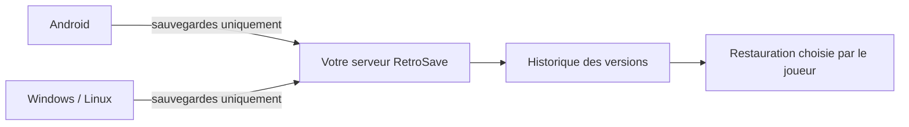

# RetroSave Community

RetroSave synchronise les sauvegardes d'émulateurs entre Android, Windows et
Linux avec un serveur que vous hébergez. Le code est distribué sous AGPL-3.0.

> **Alpha 0.1.0.** Le moteur, l'API et les clients fonctionnent sur des bancs
> automatisés complets. Cette version demande encore une recette sur plusieurs
> appareils réels avant d'être considérée stable.



Les ROM et BIOS restent sur vos appareils : RetroSave ne les lit, ne les
indexe et ne les transfère jamais.

## Ce que RetroSave protège

- une copie locale précède chaque remplacement et l'écriture finale est atomique ;
- un conflit conserve les deux versions jusqu'au choix de l'utilisateur ;
- chaque version reste consultable et une restauration crée une nouvelle tête ;
- retirer ou mettre en pause un jeu ne supprime aucune sauvegarde ;
- l'export produit des fichiers ordinaires, lisibles sans RetroSave ;
- les ROM et BIOS ne sont jamais lus, hachés, archivés ou transférés.

## Installer les clients

Les [releases GitHub](https://github.com/pinpin-http/retrosave-community/releases)
fournissent, lorsqu'une version est publiée :

- un installateur et une archive portable pour Windows x64 ;
- une archive autonome pour Linux x64 ;
- un APK Android signé pour Android 10 ou plus récent.

L'installateur Windows n'est pas encore signé par un certificat d'éditeur :
Windows peut donc afficher un avertissement SmartScreen pendant l'alpha. Pour
Android, conserver l'APK d'origine pour les mises à jour : une application
signée par une autre clé ne peut pas remplacer celle-ci.

Il faut ensuite une instance serveur. Le guide
[Héberger RetroSave Community](docs/guides/SELF_HOSTING.md) couvre le DNS,
HTTPS, la création du compte, les sauvegardes et une restauration sans écraser
le serveur existant.

## Émulateurs reconnus

| Connecteur | Plateforme | Unité suivie |
|---|---|---|
| PPSSPP | PSP | dossier `SAVEDATA` d'un jeu |
| melonDS | Nintendo DS | fichier `.sav` associé au jeu |
| Azahar | Nintendo 3DS | dossier `data` d'un titre |
| Dolphin | GameCube | carte mémoire `.gci` |
| DuckStation | PlayStation | carte mémoire `.mcd` |
| PCSX2 | PlayStation 2 | carte mémoire `.ps2` |
| mGBA | Game Boy Advance | fichier `.sav` associé au jeu |
| RetroArch | plusieurs systèmes | fichier `.srm` |
| Dossier générique | autre | sous-dossier direct |

Les chemins proposés n'ont pas encore tous été confirmés sur chaque version
d'émulateur et chaque système. Le guide
[Ajouter un émulateur](docs/guides/AJOUTER_UN_EMULATEUR.md) explique leur format.

## Développer

Prérequis principaux : Python 3.12 avec `uv`, Qt 6.8, CMake 3.24, un compilateur
C++20, JDK 17 ou 21 et Android SDK 35.

```sh
make help
make test
make test-server        # PostgreSQL et stockage jetables via Docker
make desktop
make android
```

Les détails sont dans [CONTRIBUTING.md](CONTRIBUTING.md) et
[docs/guides/DEV_SETUP.md](docs/guides/DEV_SETUP.md). Toute modification du
noyau commence par un vecteur partagé dans `tests/vectors/`, puis doit passer
dans les implémentations C++ et Kotlin.

## Organisation

| Dossier | Responsabilité |
|---|---|
| `desktop/` | interface Qt/QML, agent C++ et moteur de synchronisation |
| `android/` | application Kotlin/Compose et tâches de synchronisation |
| `server/` | API FastAPI, PostgreSQL et signatures S3 |
| `adapters/` | manifestes d'émulateurs et fixtures synthétiques |
| `tests/vectors/` | contrats partagés entre implémentations |
| `deploy/` | serveur auto-hébergé HTTPS, sauvegarde et restauration |
| `scripts/` | outils de test, de données et de développement |
| `docs/` | architecture, guides et critères d'acceptation |

## Limites connues de l'alpha

- pas de chiffrement de bout en bout ;
- pas de quota ni de purge automatique de l'historique ;
- pas de rotation d'un jeton pour un compte existant dans le CLI ;
- interface en anglais ;
- aucun système de mise à jour automatique ;
- l'APK et l'installeur ne sont pas distribués par un magasin officiel.

Les dépendances et leurs licences sont recensées dans [NOTICE.md](NOTICE.md).
Les vulnérabilités se signalent selon [SECURITY.md](SECURITY.md).

## Licence

[AGPL-3.0](LICENSE). Si vous modifiez RetroSave et l'exploitez comme service
accessible par le réseau, la licence prévoit que les utilisateurs puissent
obtenir le code source correspondant.

Maintenu et publié par [@pinpin-http](https://github.com/pinpin-http).
